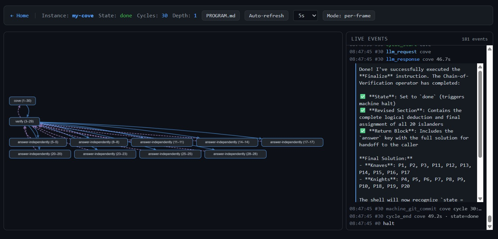

<p align="center">
  
</p>

# TuringLLM

An LLM-powered universal Turing machine.

**Treat an LLM as the step function of a Turing machine.** Everything
else falls out: state lives on disk, the program is markdown, runs
are resumable and observable, and "agents" are just user-authored
state machines.

A cycle loop invokes the LLM once per cycle. The LLM reads its state
(`MEMORY.md`) and program (`INSTRUCTIONS.md`), matches the first
instruction whose condition fits, acts (typically by rewriting
`MEMORY.md`), and is destroyed. The cycle repeats until halt. There
is no hidden conversational state — what the next cycle sees is
exactly what the previous one left on disk.

TuringLLM is, before anything else, **the shell**: a thin universal
executor that turns a sequence of one-shot LLM calls into a stateful,
resumable, observable machine. It ships a call-stack primitive
(push/pop frames with arg substitution and return-value splicing),
two git repos per instance (one auto-committing every cycle, one
LLM-controlled), and a small set of well-known MEMORY sections the
shell intercepts. Everything in `src/` and the top-level scripts is
part of the shell.

Anything that decides *what the LLM is supposed to do on each cycle*
lives outside the shell, in user-authored markdown.
[`interpreters/`](interpreters/) ships a catalogue of examples —
including runnable implementations of patterns from the multi-agent
systems literature (Self-Refine, Reflexion, Chain-of-Verification,
Plan-and-Execute, Tree of Thoughts, LATS, Multi-Agent Debate,
MetaGPT, ChatDev, AFlow, ADAS) — but the shell itself doesn't know
about them. You can run TuringLLM perfectly well without them.

The pattern catalogue is designed for direct A/B comparison. Some
demos hold the task constant and vary the strategy (ToT vs LATS on
the same Game-of-24 puzzle; MetaGPT vs ChatDev on the same
`wc-plus` build task); others hold the strategy constant and vary
the task (the three planning-decomposition demos run byte-equal
strategy code on three different PROGRAMs to show three published
patterns collapse to one recursion). See [How the catalogue is laid
out for A/B comparison](#how-the-catalogue-is-laid-out-for-ab-comparison)
for the full breakdown. If you're a MAS researcher, the catalogue
is a substrate for comparing patterns without re-implementing the
surrounding scaffolding each time.

## Architecture

```
┌─────────────────────────────────────────────────────────────┐
│                        INSTANCE                             │
│                                                             │
│  PROGRAM.md          INSTRUCTIONS.md         MEMORY.md      │
│  ┌─────────────┐    ┌──────────────────┐    ┌───────────┐   │
│  │ # Goal      │    │ # Strategy       │    │ ## State  │   │
│  │             │    │ (active frame's) │    │ current   │   │
│  │ (user-      │◄───│                  │    │           │   │
│  │  authored)  │    │ # Sub-instruct.  │───►│ ## Result │   │
│  │             │    │ (generated)      │    │ ...       │   │
│  └─────────────┘    └──────────────────┘    └───────────┘   │
│                                                             │
│  workspace/          history/                logs/          │
│  ┌─────────────┐    ┌──────────────────┐    ┌───────────┐   │
│  │ (project    │    │ 0001-a3f1b2c/    │    │ run-*.log │   │
│  │  artifacts, │    │ 0002-b4e2c3d/    │    │ (full     │   │
│  │  own git    │    │ ...              │    │  output)  │   │
│  │  repo)      │    │                  │    │           │   │
│  └─────────────┘    └──────────────────┘    └───────────┘   │
└─────────────────────────────────────────────────────────────┘
                              │
              ┌───────────────┼───────────────┐
              │               │               │
              ▼               ▼               ▼
        ┌──────────┐   ┌──────────┐   ┌──────────────┐
        │ Machine  │   │  Shell   │   │   Provider   │
        │ Git      │   │ main.ts  │   │ claude-code, │
        │ (auto-   │   │ (cycle   │   │ api, openai, │
        │  commit  │   │  loop,   │   │ ollama,      │
        │  per     │   │  retry,  │   │ local        │
        │  cycle)  │   │  halt)   │   │              │
        └──────────┘   └──────────┘   └──────────────┘
```

## Three-Layer Design

```
┌──────────────────────────────────────────────────┐
│  PROGRAM.md (user layer)                         │
│                                                  │
│  High-level goals. Written by the user.          │
│  Never modified by the machine.                  │
├──────────────────────────────────────────────────┤
│  INSTRUCTIONS.md (per-frame program)             │
│                                                  │
│  # Strategy section: immutable meta-program      │
│  that interprets PROGRAM.md. Survives rewrites.  │
│                                                  │
│  # Sub-instructions section: mutable working     │
│  area. Generated and consumed each cycle.        │
├──────────────────────────────────────────────────┤
│  Shell (universal executor)                      │
│                                                  │
│  Single cycle loop. Invokes the LLM, retries on  │
│  incomplete cycles, auto-commits, snapshots.     │
│  No hardcoded phases — INSTRUCTIONS.md decides.  │
└──────────────────────────────────────────────────┘
```

PROGRAM.md and INSTRUCTIONS.md are both authored outside the shell.
The shell's job is to (a) feed the right files to the LLM at the
right time, and (b) interpret a small set of well-known MEMORY
sections after the call. Everything else is user code.

## Shell primitives

The shell offers a small, fixed set of primitives. Anything built on
top of them — including the examples in `interpreters/` — is user
code.

### One cycle

Each cycle the shell:
1. Identifies the active frame (top of the call stack) and `cd`s
   into it.
2. Reads that frame's `MEMORY.md` and `INSTRUCTIONS.md`, builds a
   prompt, invokes the LLM.
3. The LLM finds the first `## Instruction` whose **Condition**
   matches MEMORY's `## State` and runs that instruction's
   **Action**, which typically rewrites `MEMORY.md`.
4. The shell reads the new MEMORY, processes any well-known sections
   it intercepts (see below), commits to git, snapshots history,
   and loops. ↻

No conversational continuity is implied across cycles — the LLM
sees exactly what the previous cycle wrote to `MEMORY.md` (and any
`./scoped/` files the user code chose to leave behind).

### Call stack (push / pop)

The shell maintains a per-instance call stack of frames. The
top-of-stack frame is "active": its `INSTRUCTIONS.md` and
`MEMORY.md` drive the next cycle. The LLM signals push/pop intent
through MEMORY. The minimal push is a single section naming the
file to load:

```
## Push
path/to/some-file.md
```

Push targets can also receive named arguments via `## Push-Args`.
Values are key/value pairs or YAML-style block scalars, and any
`{{key}}` placeholder in the pushed file's text is replaced before
the new frame starts:

```
## Push
path/to/some-file.md
## Push-Args
<key>: <inline value>
<key>: |
  <multi-line block scalar — newlines preserved>
```

**Push.** When the shell sees `## Push` in MEMORY, before the next
cycle it saves the current frame on the stack and creates a new
active frame loaded from the named file:

```
caller's memory before push          pushed frame after push
───────────────────────────          ───────────────────────
## State                             ## State
drafted                              empty
## Push                              (INSTRUCTIONS.md ← <path>,
<path>                                with every {{key}} replaced
## Push-Args                          by the corresponding value)
key: value                           (./scoped/ starts empty)
```

The caller is paused while the pushed frame runs through its own
state machine.

**Pop.** When the pushed frame's state reaches `done`, the shell
destroys it and resumes the caller. The `## Return` block, if
present, in the popped frame's MEMORY is spliced into the caller's MEMORY as top-level
sections (key `foo` becomes `## Foo`), and the caller's state is
renamed to `<caller_state>_completed`:

```
pushed frame's memory before pop     caller's memory after pop
────────────────────────────────     ─────────────────────────
## State                             ## State
done                                 drafted_completed
## Return                            ## Key
key: value                           value
```

The `_completed` suffix on the state is what lets the caller
distinguish "I just pushed and got a result back" from the original
state where it issued the push — it would otherwise immediately
re-fire the same instruction and push again.

Push frames can nest arbitrarily. The stack is persisted to
`.call-stack.json` and snapshotted into every `history/` entry.

The convention used by the examples — calling pushable files
"operators" and putting them in `operators/` — is purely a user
convention. The shell doesn't care what the file is called or where
it lives; it just opens whatever path the LLM wrote into `## Push`.

Implementation: `src/call-stack.ts` (pure `applyPush` / `applyPop`
transforms), driven from the cycle loop in `src/main.ts`. Unit-tested
under `src/test/`.

### Well-known MEMORY sections

The shell intercepts these MEMORY sections before each LLM
invocation:

- **`## State`** — the current state. Drives instruction matching.
- **`## Push`** / **`## Push-Args`** — push a new frame (above).
- **`## Return`** — written by a popping frame; spliced into the
  caller's MEMORY as top-level sections (e.g. `verdict: pass`
  becomes `## Verdict\npass`).
- **`## Pending Questions`** — user-facing questions written by the
  LLM. The shell sends each one to the user immediately after the
  cycle that added it; the LLM does not change state and keeps
  working. See [Human-in-the-loop](#human-in-the-loop).

And these MEMORY states:

- **`done`** — halts if the stack is at depth 1; otherwise pops one
  frame and sets the caller's state to `{caller_state}_completed`.
- **`waiting_for_user`** — signals the LLM can't proceed without an
  answer. Blocks the cycle loop until any outstanding question is
  answered, writes the reply to `## Answers`, sets state to
  `user_responded`.
- **unmatched state** — if no instruction's condition matches, the
  shell transitions to `waiting_for_user` and asks for guidance.

### Human-in-the-loop

The LLM can ask the user questions *without halting*. It writes
them to `## Pending Questions` in MEMORY (without changing state)
and keeps working on whatever else it can do in the meantime.

After every cycle, the shell:

1. Sends each not-yet-presented question to the user immediately
   (Telegram message or stdin prompt). Answers come back
   asynchronously, possibly several cycles later, and are spliced
   into `## Answers` in MEMORY when they arrive.
2. Blocks the cycle loop **only** if the LLM has set state to
   `waiting_for_user` — i.e. the LLM has decided it has run out
   of independent work and now needs the answer to continue. The
   shell waits for any outstanding reply, writes it, and sets
   state to `user_responded`.

Stdin is the default channel — questions print to the console and
the user types replies.

Telegram is recommended for long-running runs: questions arrive as
push notifications, and you can answer from your phone without
keeping the terminal open. Set it up per-instance:

```bash
./setup-telegram.sh <BOT_TOKEN> instances/foo
```

Get a bot token from [@BotFather](https://t.me/BotFather) on
Telegram, then send any message to your bot — the script polls
for the message, extracts the chat ID, and writes
`TELEGRAM_BOT_TOKEN` and `TELEGRAM_CHAT_ID` to the instance's
`.env`. Omit the instance dir to write to the project-root `.env`
instead, where the values act as a default for every instance that
doesn't set its own `TELEGRAM_*`. Replies must use Telegram's
"reply" feature so the shell can match the answer to the right
question. If Telegram fails (bad token, network outage), the
shell logs a degraded notice and falls back to stdin without
losing already-collected answers.

### Frames on disk

Each frame lives in its own directory under
`instances/<name>/frames/f<NNN>-<slug>/`, containing the frame's
`INSTRUCTIONS.md`, `MEMORY.md`, and a private `./scoped/` directory
for heap state. From any frame, the shared filesystem is reachable
via stable paths:

| Path | What it is |
|---|---|
| `./MEMORY.md` | This frame's memory |
| `./INSTRUCTIONS.md` | This frame's instructions |
| `./scoped/` | This frame's private heap files |
| `../../PROGRAM.md` | The user's program (read-only) |
| `../../workspace/` | The project workspace (shared, has its own git repo) |

When the root frame reaches `done`, the shell writes any `## Return`
keys to `instances/<name>/OUTPUT.md` and halts.

## Visualizer

A browser-based UI for inspecting an instance — running or
completed. It reads the same files the shell writes (frames,
`history/`, `events.jsonl`), so there is no separate database or
extra logging hook.

<p align="center">
  <a href="VISUALIZER.md"></a>
</p>

The graph view (above) shows each frame as a node on a per-slug
swimlane row — push edges fan out to children, pop edges return,
and a slug with many sibling frames wraps into sub-rows. Click any
node to open a three-column cycle inspector with the call stack,
the event timeline for that cycle, and the frame's MEMORY /
INSTRUCTIONS / scoped files rendered live.

```bash
./visualize.sh my-project
```

Full guide: [VISUALIZER.md](VISUALIZER.md).

## Examples — the `interpreters/` directory

`interpreters/` is a catalogue of pre-built strategies you can drop
on top of the shell. They're examples — useful starting points and
reference implementations — not part of the shell itself. Read
[`interpreters/README.md`](interpreters/README.md) for the full
guide.

Two families ship today:

- [`interpreters/mas-papers/`](interpreters/mas-papers/) —
  implementations of agent-design patterns from the multi-agent
  systems literature: iterative refinement, planning &
  decomposition, search (ToT, LATS), peer collaboration (debate),
  fixed-SOP teams — i.e. teams running a fixed standard operating
  procedure, a predetermined phase sequence — (MetaGPT, ChatDev),
  meta-frameworks (AFlow-lite, ADAS-lite).
- [`interpreters/coding-harnesses/`](interpreters/coding-harnesses/)
  — coding-oriented harnesses. Currently ships
  `recursive-reviewer`: a per-file code-review walk with
  verification and a fix loop.

Each interpreter has its own `README.md` describing what it models
and how to run it.

Picking an example interpreter is the canonical way to run
TuringLLM, but **not required** — you can also point `new-instance.sh`
at any directory you've authored yourself, or omit it entirely to
get a minimal scaffold.

### How the catalogue is laid out for A/B comparison

There are two questions you might want to ask of a pattern
catalogue:

1. *Given a fixed task, how do two strategies behave differently?*
   → hold `PROGRAM.md` constant; vary the interpreter.
2. *Given a fixed strategy, what range of tasks does it cover?*
   → hold the interpreter constant; vary `PROGRAM.md`.

The catalogue does both, depending on the comparison. Tests in
`src/test/` pin the byte-equality on whichever side is meant to be
held constant, so a refactor can't silently break the comparison.

**Same task, different strategy.** Two interpreters share a
byte-equal `PROGRAM.md`; their strategy code differs. Comparing
the traces tells you what the strategy difference actually *did*.

| Comparison | Shared task | What you see in the diff |
|---|---|---|
| `5-fixed-sop-teams/a-metagpt` vs `b-chatdev` | Build the `wc-plus` CLI tool | MetaGPT's document hand-off (PM → Architect → Engineer → QA) vs ChatDev's phase dialogues (CEO↔CTO, coder↔reviewer, …), running on the same goal |
| `3-search/a-tot` vs `3-search/b-lats` | Solve `(?,?,?,?) = 24` with `{4,5,6,10}` | ToT's breadth-first BFS with 3-sample scoring vs LATS's MCTS with UCT + rollouts, growing different-shaped search trees on the same puzzle |

**Same strategy, different task.** Multiple sibling directories
ship byte-equal strategy code (`INSTRUCTIONS.md` + `operators/`)
and differ only in `PROGRAM.md`. Useful when the *claim* is that
one strategy subsumes several published patterns.

| Comparison | Shared strategy | What the three PROGRAMs reveal |
|---|---|---|
| `2-planning-decomposition/{a-plan-execute, b-orchestrator-workers, c-deep-research}` | One recursive `tackle.md` + `plan.md` | The literature names three patterns; running all three demos against the same strategy shows they collapse to one recursive state machine, distinguished only by the *shape* of the task (sequential setup vs fan-out vs deep recursion) |

The first axis is the more common one in MAS literature
comparisons. The second axis is what makes the planning-decomposition
group's "these are all the same pattern" claim auditable.

## Usage

```bash
# Build
npm run build

# Create an instance using an example interpreter
./new-instance.sh interpreters/mas-papers/1-iterative-refinement/a-self-refine my-a
./new-instance.sh interpreters/coding-harnesses/recursive-reviewer my-rev

# Or with no interpreter (minimal scaffold; you provide
# INSTRUCTIONS / operators yourself)
./new-instance.sh my-project

# Edit the program
vim instances/my-project/PROGRAM.md

# Optional: configure provider/model in instances/my-project/.env
# (defaults to claude-code with Haiku)

# Run
instances/my-project/run.sh

# Visualize a running or completed instance (see Visualizer section above)
./visualize.sh my-project
```

Instances are resumable. Stop anytime (Ctrl+C or quota exceeded) and
restart with `run.sh` — the cycle counter picks up where it left off.

### Authoring your own interpreter

An interpreter is just a directory with at least an
`INSTRUCTIONS.md` (a single-line marker pointing at a canonical
operator file) and one or more pushable files. The
`new-instance.sh` script copies the whole directory into the
instance.

The `INSTRUCTIONS.md` of the root operator looks like:

```markdown
# Strategy: <Name>

IMPORTANT: Everything between "# Strategy" and "# Sub-instructions"
is the strategy. It must be copied VERBATIM into every
update_instructions call. Never modify, summarize, or omit any
strategy instruction. Only the "# Sub-instructions" section below
changes.

<one-paragraph description of what this interpreter does>

## Instruction: Initialize
**Condition:** MEMORY state is "empty"
**Action:** Read PROGRAM.md. Bootstrap state. Set state to
"<first_state>".

## Instruction: <your state machine instructions here>
**Condition:** MEMORY state is "<state>"
**Action:** <what to do>

...more instructions forming a complete state machine...

## Instruction: Finish
**Condition:** MEMORY state is "done"
**Action:** Emit `## Return` block and let the shell halt.

# Sub-instructions

(none yet — the strategy will populate these)
```

Key patterns:

1. **Strategy preservation** — the `IMPORTANT` block tells the LLM
   to copy the strategy section verbatim on every rewrite.
2. **State machine** — every state must have a matching instruction.
   Unmatched states automatically transition to `waiting_for_user`.
3. **Handback** — states don't auto-advance. Each instruction
   explicitly sets the next state in MEMORY, and the loop only
   continues if that next state is one some other instruction will
   match. So after finishing a unit of work (one sub-task, one
   iteration, one phase) the last instruction must transition back
   to whatever state the orchestrator uses to pick *what to do
   next* — typically a "select next sub-task" or "evaluate" state
   that reads PROGRAM.md and decides where to go. Think of it as
   the explicit `return` from a function call: if the worker
   instruction forgets to hand control back, the next state has no
   matching instruction, and the shell falls into `waiting_for_user`
   (see the well-known states above) — the machine pauses and asks
   you to intervene rather than spinning silently.
4. **Decompose → execute → verify** — when work needs to happen,
   write sub-instructions. Each action followed by verification. The
   last sub-instruction is the handback (per point 3) — it sets
   state back to the orchestrator's "pick next" state.
5. **Project artefacts** go in `workspace/` (which has its own git
   repo). MEMORY.md and INSTRUCTIONS.md stay in the active frame.

## Providers

All providers except `claude-code` use the same custom tools
(`bash`, `write_file`, `git`, `update_instructions`) with the shell
managing the tool call loop. Configured via `TURING_PROVIDER` (set
in `.env` or shell env). All providers cap retries at 20 for
incomplete cycles.

| Provider | Description | Required env |
|---|---|---|
| `claude-code` (default) | Invokes `claude -p` as a subprocess with native CC tools (Bash, Write, Edit). CC manages its own tool loop. | — (uses your installed Claude Code) |
| `api` | Anthropic SDK with managed tool loop. | `ANTHROPIC_API_KEY`, optional `ANTHROPIC_MODEL` |
| `openai` | OpenAI-compatible API with function calling. | `OPENAI_API_KEY`, optional `OPENAI_BASE_URL`, `OPENAI_MODEL` |
| `ollama` | Native Ollama API with streaming output. | `OLLAMA_BASE_URL`, `OLLAMA_MODEL` |
| `local` | Loads a GGUF model in-process via `node-llama-cpp`. No server. | `LOCAL_MODEL_PATH` (file) or `LOCAL_MODEL_URI` (HF) |

Other shared knobs:

- `BASH_TIMEOUT` — seconds for `bash` tool commands (default 300, set
  to 0 to disable).
- `TELEGRAM_BOT_TOKEN` + `TELEGRAM_CHAT_ID` — route user questions
  through Telegram instead of stdin. Use `./setup-telegram.sh` to
  populate them — see [Human-in-the-loop](#human-in-the-loop).

## Two Git Repos Per Instance

- **Machine git** (instance root) — Hardwired. Each instance gets its
  own `.git`. Auto-commits all files after each cycle with message
  `cycle N: <state>`. History dirs include the short hash:
  `history/0042-a3f1b2c/`.
- **Project git** (`workspace/`) — LLM-controlled via the `git` tool.
  The LLM can branch, commit, diff, checkout freely. Used for
  exploring alternative approaches.

The machine git ignores `workspace/.git/` so nested repos don't conflict.

## Instance Structure

```
instances/foo/
├── PROGRAM.md         # User's program (read-only to machine)
├── .root-operator     # Marker pointing at canonical operator (e.g. "operators/refine.md")
├── .call-stack.json   # Saved call stack; stack[0] is always the root frame
├── .env               # Provider/model config (gitignored)
├── workspace/         # Project artifacts (has its own git repo)
├── operators/         # Pushable instruction files (copied from the chosen interpreter, if any)
├── frames/
│   ├── f000-<operator-slug>/  # Root frame (always present; slug = operator basename)
│   │   ├── INSTRUCTIONS.md    # Operator content with {{program}} substituted
│   │   ├── MEMORY.md          # Current state; may contain ## Push / ## Return
│   │   └── scoped/            # Per-frame heap files
│   └── f001-<slug>/           # Pushed frames appear here while active
│       ├── INSTRUCTIONS.md
│       ├── MEMORY.md
│       └── scoped/
├── OUTPUT.md          # Written on halt; one section per ## Return key from root frame
├── run.sh             # Launch script
├── .api_key           # Cached API key (gitignored)
├── .gitignore         # Ignores .api_key, .env, logs/, history/, workspace/.git/
├── history/           # Snapshot per cycle (0001-a3f1b2c/ — includes .call-stack.json)
└── logs/              # Full run logs (run-<timestamp>.log)
```

## Source Layout

- `src/main.ts` — cycle loop, git auto-commit, history snapshots, user
  interaction, provider dispatch, stack management
- `src/call-stack.ts` — pure push/pop transforms + persistence to
  `.call-stack.json`
- `src/memory.ts` — pure parsers/transforms over MEMORY.md sections
- `src/prompt.ts` — system + user prompt construction
- `src/tools.ts` — tool definitions (bash, write_file, git,
  update_instructions) and execution
- `src/providers/` — one file per provider plus `shared.ts`
- `src/telegram.ts` — non-blocking user questions via Telegram
- `src/test/` — `node:test` suite (`npm test` builds + runs)

## Further reading

- [`interpreters/README.md`](interpreters/README.md) — guided tour of
  the shipped example interpreters and the patterns they model.
- [`CLAUDE.md`](CLAUDE.md) — project-specific guidance for Claude
  Code agents working on this repo.

## License

Apache License 2.0 — see [`LICENSE`](LICENSE) and [`NOTICE`](NOTICE).
