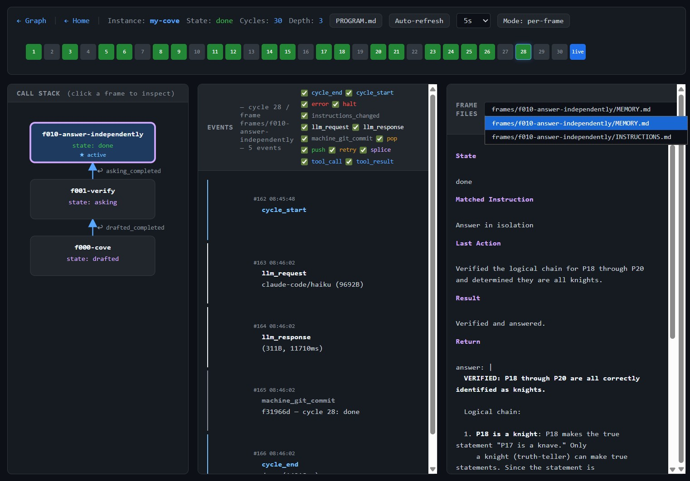

# Visualizer

A browser-based UI for inspecting TuringLLM instances — running or
completed. The visualizer reads the same files the shell writes to
disk (no separate database, no extra logging hook), so anything
on disk is fair game.

## Launch

```bash
npm run build                # one-time, after src/ changes
./visualize.sh               # home page — pick an instance in the browser
./visualize.sh my-project    # jump straight to instances/my-project
./visualize.sh my-project 9000   # custom port (default 8080)
```

`visualize.sh` starts a tiny static file server (`src/server.ts`)
rooted at the repo, opens your default browser at
`http://localhost:<port>/visualizer.html`, and serves the
single-page app plus the on-disk instance files it asks for. Stop
with Ctrl+C.

The visualizer is a single HTML file (`visualizer.html`) using
[marked](https://github.com/markedjs/marked),
[mermaid](https://mermaid.js.org/), and
[cytoscape](https://cytoscape.org/) loaded from CDN. No build
step.

## What it shows

### Home page

A table of every instance under `instances/`, with current state,
cycle count, and last-update time. Click any row to drill in.

### Instance — Graph view

<p align="center">
  
</p>

A cytoscape graph of the instance's execution: each cycle is a
node, edges show transitions, push/pop changes are highlighted, and
a side panel streams **live events** as the shell emits them.

Two graph modes, toggled with the **Mode** button:

- **per-frame** — one node per frame, grouped into swimlane rows by
  slug. Rows pack from the left by occurrence order, and a slug with
  many frames wraps into up to three sub-rows (see the
  `answer-independently` row in the screenshot above).
- **per-cycle** — one node per cycle, with x = absolute cycle.

A **timeline strip** above the graph lets you scrub through cycles
chronologically.

### Instance — Cycle view

<p align="center">
  
</p>

Click a graph node (or use the timeline) to open the three-column
cycle inspector:

- **Call Stack** — SVG drawing of the stack at this cycle. Click a
  frame to inspect it.
- **Events** — the events emitted during this cycle (or filtered to
  the selected frame), with type-filter chips.
- **Frame Files** — picker showing the selected frame's
  `MEMORY.md`, `INSTRUCTIONS.md`, and any files under `scoped/`.
  Markdown is rendered; everything else is shown as code.

### Top bar

- Instance name, current state, cycle count, stack depth.
- **PROGRAM.md** button — opens the user's program in an overlay.
- **Interpreter README** button — opens the interpreter's README
  if one was copied into the instance.
- **Auto-refresh** toggle and interval picker (2s / 5s / 10s /
  30s) — useful for watching a live run.

## Data sources

The visualizer reads these files directly from `instances/<name>/`:

| File | Used for |
|---|---|
| `.call-stack.json` | current stack (live tip) |
| `frames/f<NNN>-<slug>/MEMORY.md` | per-frame memory |
| `frames/f<NNN>-<slug>/INSTRUCTIONS.md` | per-frame instructions |
| `frames/f<NNN>-<slug>/scoped/*` | per-frame heap files |
| `history/<NNNN>-<hash>/` | per-cycle snapshots (full frame trees + stack) |
| `logs/events.jsonl` | event stream (push / pop / cycle / answer / …) |
| `PROGRAM.md` | overlay |
| `frames/f000-*/README.md` | interpreter README overlay (if present) |

Everything is fetched on demand — open files are re-read on each
refresh tick.

## Auto-refresh

Toggle **Auto-refresh** to repoll the active view at the chosen
interval. The shell appends to `events.jsonl` and writes a new
`history/<NNNN>-<hash>/` snapshot per cycle, so the graph extends
in place and the live event stream tails the latest activity.

## Live vs historical

The "live" cycle (the in-flight one) is read from the
instance-root files (`MEMORY.md`, `INSTRUCTIONS.md`,
`.call-stack.json`); historical cycles are read from
`history/<NNNN>-<hash>/`. The cycle view exposes both — the
timeline ends with a "live" tip when a run is in progress.

## Troubleshooting

- **Browser didn't open** — open the URL the script prints
  manually (`http://localhost:<port>/visualizer.html`).
- **Port already in use** — pass a different port:
  `./visualize.sh my-project 9000`.
- **Graph empty** — the instance has no cycles yet. Wait one cycle
  or re-check `instances/<name>/history/`.
