# Design: instance-graph-visualization

## Overview

Add a graph view to `visualizer.html` as the new default content of the
instance page. The graph is built from the existing `events.jsonl` event
log plus the per-cycle `.call-stack.json` snapshots that the shell already
writes — no shell-side data emission changes are needed. Graph rendering
uses Cytoscape.js (loaded from CDN, matching the existing `marked` /
`mermaid` pattern), driven by a pure graph-builder module that we
extract to `src/visualizer/graph-builder.ts` so it can be unit-tested
under `node:test`. The existing 3-column per-cycle layout becomes a
URL-addressable drill-down opened by clicking a graph node.

## Requirement coverage

| R# | Summary                                                  | Addressed in                       |
| -- | -------------------------------------------------------- | ---------------------------------- |
| R1 | Graph view is default for `?instance=<path>`              | §URL routing, §Architecture         |
| R2 | Pan, zoom, hover via a graph library                      | §Library choice, §Interfaces        |
| R3 | Two modes (per-frame, per-cycle)                          | §Architecture, §Data model          |
| R4 | Per-frame is default on first load                        | §URL routing, §Architecture         |
| R5 | Per-frame: one node per frame instance                    | §Data model, §Graph-builder         |
| R6 | Per-cycle: one node per (frame, cycle) pair               | §Data model, §Graph-builder         |
| R7 | Swimlane layout: row per slug, left-to-right by time      | §Layout                             |
| R8 | Per-frame edges: push + pop                               | §Graph-builder                      |
| R9 | Per-cycle edges: push + pop + within-row continuity       | §Graph-builder                      |
| R10 | Node labels: `slug (first–last)` or `slug #N`            | §Graph-builder                      |
| R11 | No status color coding on nodes                           | §Layout (style)                     |
| R12 | Per-frame node click → drill-down at first cycle          | §URL routing, §Interfaces           |
| R13 | Per-cycle node click → drill-down at that cycle           | §URL routing, §Interfaces           |
| R14 | Header bar (incl. PROGRAM.md / README / Auto-refresh)    | §Architecture (header is preserved) |
| R15 | Mode-toggle control in header                             | §Architecture, §Interfaces          |
| R16 | Timeline (cycle-dot row) removed in graph view            | §Architecture                       |
| R17 | Auto-refresh re-fetches + redraws graph at interval       | §Architecture                       |
| R18 | "← Graph" back link in cycle drill-down                   | §URL routing                        |
| R19 | URL-encoded drill-down state                              | §URL routing                        |
| R20 | Empty instance → placeholder, not error                   | §Error handling, §Graph-builder     |
| R21 | Active frame's lastCycle = current/latest cycle           | §Graph-builder                      |

## Architecture

```mermaid
flowchart TD
    URL["URL params"] --> Bootstrap[bootstrap]
    Bootstrap --> RoutePicker{cycle param present?}
    RoutePicker -->|no| GraphView[Graph view default]
    RoutePicker -->|yes| CycleView[Cycle view existing 3-col]

    GraphView --> Loader[loadInstanceForGraph]
    Loader --> ReadEvents[fetch events.jsonl]
    Loader --> ReadStack[fetch live .call-stack.json]
    ReadEvents --> Builder[graph-builder.buildGraph]
    ReadStack --> Builder
    Builder --> Cyto[Cytoscape render]

    Cyto -->|click node| URLPush[history.pushState&#40;cycle, frame&#41;]
    URLPush --> CycleView

    CycleView -->|"&larr; Graph link"| URLClear[history.pushState&#40;no cycle&#41;]
    URLClear --> GraphView
```



**Page structure inside `visualizer.html`:**

```
<body>
  #homePage           ← unchanged
  #instancePage
    .topbar           ← header retained (R14); + new mode toggle (R15)
    #graphView        ← new; hosts Cytoscape <div id="cyGraph">
    #cycleView        ← existing 3-column layout, .grid-3col
                        moved into this wrapper; timeline removed
                        from header (R16); + new "← Graph" back link (R18)
  #payloadModal       ← unchanged
  #docModal           ← unchanged
```

`bootstrap()` reads `?instance` + `?cycle` + `?frame` + `?mode` from
the URL and toggles `#graphView` vs `#cycleView` visibility. Graph
mode (`frame` vs `cycle`) is controlled by `?mode=cycle` (default
absent = `frame` per R4).

**Reuse:** the existing `loadInstance()`, `loadCycleSnapshot()`,
`renderTimeline()`, `renderStackGraph()`, file-panel, and events-panel
code is reused unchanged for the cycle drill-down view. The graph view
adds new functions but does not replace any of them. Composition over
replacement.

## Data model

**Source data (already on disk; no shell changes):**
- `instances/<name>/logs/events.jsonl` — sequential events with
  `{ seq, cycle, frame, type, ... }` envelope. Push events carry
  `{ target, frameDir, depth }`; pop events carry `{ frameDir,
  returnState, depth }`. (`src/events.ts:65-69`)
- `instances/<name>/.call-stack.json` — current live stack (used to
  determine which frames are still active for R21).

**Derived in-memory types (`src/visualizer/graph-builder.ts`):**

```ts
// satisfies: R5, R21
export interface Frame {
  frameDir: string;       // e.g. "frames/f001-dialogue"
  slug: string;           // e.g. "dialogue" (parsed from frameDir)
  firstCycle: number;     // first cycle_start where frame === frameDir
  lastCycle: number;      // last cycle_start; or current cycle if active
  isActive: boolean;      // true iff frameDir is on the live call stack
}

// satisfies: R6
export interface CyclePoint {
  cycle: number;
  frameDir: string;
  slug: string;
}

// satisfies: R5, R6, R10
export interface GraphNode {
  id: string;             // per-frame: frameDir; per-cycle: `${frameDir}@${cycle}`
  label: string;          // R10 format
  slug: string;           // for row assignment
  cycle: number;          // first cycle for per-frame; the cycle for per-cycle
  frameDir: string;       // for click-through
}

// satisfies: R8, R9
export interface GraphEdge {
  source: string;         // GraphNode.id
  target: string;         // GraphNode.id
  type: "push" | "pop" | "continuity";
}

export interface Graph {
  nodes: GraphNode[];
  edges: GraphEdge[];
  slugRowOrder: string[]; // top-to-bottom row assignment by slug
}
```

**Slug parsing.** `parseSlug("frames/f001-dialogue") === "dialogue"`.
Strip `frames/` prefix, strip `f<digits>-` prefix, return remainder.
For the root frame (`frames/f000-strategy`) this yields `"strategy"`.

## Interfaces / API

**Graph builder** (`src/visualizer/graph-builder.ts`):

```ts
// satisfies: R5, R7, R8, R10, R11, R20, R21
export function buildPerFrameGraph(
  events: EventRecord[],
  liveStack: CallStack | null
): Graph;

// satisfies: R6, R7, R9, R10, R11, R20, R21
export function buildPerCycleGraph(
  events: EventRecord[],
  liveStack: CallStack | null
): Graph;

// satisfies: R7
export function computeSlugRowOrder(events: EventRecord[]): string[];

// satisfies: R5, R6 (helper)
export function parseSlug(frameDir: string): string;
```

`EventRecord` and `CallStack` mirror the JSON shapes the shell writes
(no new types invented; reuse the structure already in
`src/events.ts` + `src/call-stack.ts`).

**Visualizer glue** (inline JS in `visualizer.html`):

```js
// satisfies: R1, R4
function bootstrap() { /* dispatch on URL params */ }

// satisfies: R2, R7, R11
function renderGraph(graph) { /* Cytoscape preset layout */ }

// satisfies: R12, R13, R19
function onNodeClick(node) {
  // navigate to ?instance=X&cycle=N&frame=F (no reload, history.pushState)
}

// satisfies: R15
function toggleGraphMode() { /* swap mode=frame ⇄ mode=cycle in URL */ }

// satisfies: R17
function refresh() {
  if (instanceView === 'graph') reloadGraphData();
  else reloadCycleData();    // existing behaviour
}

// satisfies: R18
function backToGraph() { /* clear cycle/frame URL params */ }
```

**URL routing (R19):** all state lives in `?instance=<path>` plus
optional `&cycle=<N>` (presence selects cycle view), `&frame=<frameDir>`
(optional, defaults to active frame at that cycle), `&mode=cycle`
(optional, selects per-cycle graph mode; default = per-frame per R4).

**Library choice (R2):** Cytoscape.js v3, loaded from
`https://cdn.jsdelivr.net/npm/cytoscape@3/dist/cytoscape.min.js`.
Matches the existing CDN pattern (`marked@12`, `mermaid@10`).
Layout is `preset` (we compute x/y per node directly rather than
relying on a layout algorithm — swimlane is deterministic).

## Layout

Both modes use the same swimlane:
- **Y axis:** `slugRowOrder.indexOf(node.slug) * ROW_HEIGHT` (top-down).
  Row order: root frame's slug ("strategy") first, then by
  first-appearance cycle order (the cycle a slug's first frame began).
- **X axis:** `node.cycle * COL_WIDTH`. For per-frame nodes,
  `node.cycle` = `firstCycle`. For per-cycle nodes, the cycle itself.
- **Edges:** Cytoscape's `curve-style: bezier` for push/pop,
  `curve-style: straight` for continuity (within-row). No color coding
  beyond minor edge-type distinctions (e.g. dashed for pop) — node
  visuals are slug + cycle text only (R10, R11).

Constants `ROW_HEIGHT`, `COL_WIDTH` chosen so a 60-cycle 3-row
instance fills a typical viewport without scroll; user can pan/zoom
via Cytoscape's built-in controls (R2).

## Error handling

- **R20 (empty instance, no cycles yet):** `buildPerFrameGraph` and
  `buildPerCycleGraph` return `{ nodes: [], edges: [], slugRowOrder: [] }`
  when given an empty events array. `renderGraph` checks for empty
  nodes and renders a centered placeholder text "Instance has no
  cycles yet" instead of an empty Cytoscape canvas.
- **events.jsonl missing or malformed:** `loadEvents()` already returns
  `[]` for missing files (existing visualizer behaviour at line 430-436).
  Empty events flows through to the R20 path.
- **CDN unreachable:** the existing markdown popup falls back to the lite
  renderer; for the graph, if `window.cytoscape` is undefined we render
  a placeholder "Graph library failed to load — check network and reload".
  This mirrors the `if (window.marked)` fallback already in `showDocModal`.
- **Unknown URL state** (e.g. `?cycle=999` for an instance with only 50
  cycles): cycle view falls back to the live cycle, same as the existing
  default-to-live behaviour at line 422-425. No error.

## Test strategy

**Unit tests** (`src/test/visualizer-graph-builder.test.ts`,
new file, `node:test`):

| R# | Test                                                                                                |
| -- | --------------------------------------------------------------------------------------------------- |
| R5 | `buildPerFrameGraph` produces N nodes for N pushed frames + 1 root                                  |
| R6 | `buildPerCycleGraph` produces N nodes for N cycles in the events log                                |
| R7 | `computeSlugRowOrder` puts strategy first, then by first-appearance order                           |
| R8 | per-frame edges include one push + one pop per push event                                           |
| R9 | per-cycle includes push, pop, AND continuity edges between consecutive same-frame cycles            |
| R10 | per-frame node label format `slug (first–last)`; per-cycle `slug #N`                               |
| R20 | empty events array → `{nodes:[], edges:[], slugRowOrder:[]}` (no throw)                             |
| R21 | a frameDir present in `liveStack` has `lastCycle = max(events.cycle)` (not its last cycle_start)    |

Test fixtures: build small synthetic event arrays inline (no real
instance dependency). Plus one fixture from a real demo instance
(`instances/demo4b/logs/events.jsonl` snapshot) checked into
`src/test/fixtures/` for an end-to-end shape check.

**URL-routing unit tests** (in the same file or a sibling):

| R# | Test                                                                             |
| -- | -------------------------------------------------------------------------------- |
| R1 / R4 | parser given `?instance=X` returns `{ view:"graph", mode:"frame" }`         |
| R12 | per-frame click handler given a `Frame{frameDir,firstCycle}` returns the right URL |
| R13 | per-cycle click handler given `(frameDir, cycle)` returns the right URL          |
| R18 | back-to-graph helper, given the current URL, returns one with cycle/frame stripped |
| R19 | round-trip parse → format → parse is identity for all routing parameters         |

**Manual / smoke** (no automation; verified during implementation):

| R# | Procedure                                                                                                |
| -- | -------------------------------------------------------------------------------------------------------- |
| R2 | Open `instances/demo4b` in graph view; pan + zoom + hover work as expected                              |
| R3 / R15 | Mode-toggle button switches per-frame ⇄ per-cycle and the URL updates                                |
| R11 | All graph nodes are the same neutral colour (no green/red/orange)                                        |
| R14 | All header buttons (Auto-refresh, PROGRAM.md, Interpreter README) still function in graph view           |
| R16 | Cycle-dot timeline is hidden in graph view                                                               |
| R17 | Start a fresh demo instance, enable Auto-refresh; nodes appear as cycles tick                            |
| R18 | Click a node → drilled in → click "← Graph" → back at graph view                                         |

**Existing test suites:** no regression expected. The 301 existing
tests cover shell behaviour (`src/main.ts`, `src/memory.ts`,
`src/call-stack.ts`, interpreter dynamics) — unrelated to the
visualizer surface.

## Open questions

- **OQ1 (deferred from requirements OQ2):** scale handling. Cytoscape.js
  comfortably renders ~1000 nodes. Per-cycle mode at 1000+ cycles
  would be visually dense but functional. We do not add virtualization
  in this iteration; if a future instance regularly exceeds 1000 cycles
  we revisit. Note this in the README so the limitation is discoverable.
- **OQ2:** should the "← Graph" back link appear *in addition to* or
  *replacing* the existing "← Home" link in cycle view? Recommend
  keeping both: `← Graph | ← Home`. Trivial UI choice; flagging only
  to confirm before implementation.
