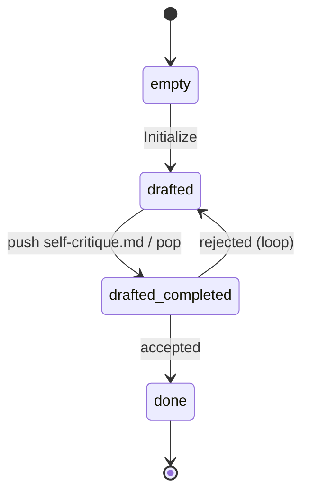

# a — Self-Refine

*Madaan et al., NeurIPS 2023 — "Self-Refine: Iterative Refinement with
Self-Feedback". See `docs/agent-workflows/patterns.md` §Group 1.*

The minimal case of the `generate → critique → revise` family. A single
role drafts, critiques its own draft via the `self-critique.md`
dynamic, then decides whether to accept or loop. No memory carries
across iterations beyond the current `## Draft`.

## State machine



Four strategy instructions: `Initialize`, `Request critique`,
`Evaluate refinement`, `Finish`.

## Dynamic: `self-critique.md`

| | |
| --- | --- |
| Consumes | `## Draft` |
| Produces | `## Critique`, `## Refined` |
| Internal states | `empty` → `critiqued` → `done` |

## Demo `PROGRAM.md`

Write a concise JSDoc docstring (≤ 3 sentences) for `parseState` in
`src/memory.ts`.

## Run it

```bash
./new-instance.sh my-a interpreters/1-iterative-refinement/a-self-refine
instances/my-a/run.sh
```

## Known behaviour

- Under self-critique, the LLM often *adds* material (examples,
  `@throws` annotations, edge-case discussion) rather than trimming.
  Strategies whose acceptance criterion includes size constraints will
  typically loop 3–5 times before converging. This is working as
  designed, not a bug.
- No iteration cap. Ctrl-C is safe; state persists in
  `instances/<name>/MEMORY.md` and re-running resumes from the next
  cycle.
