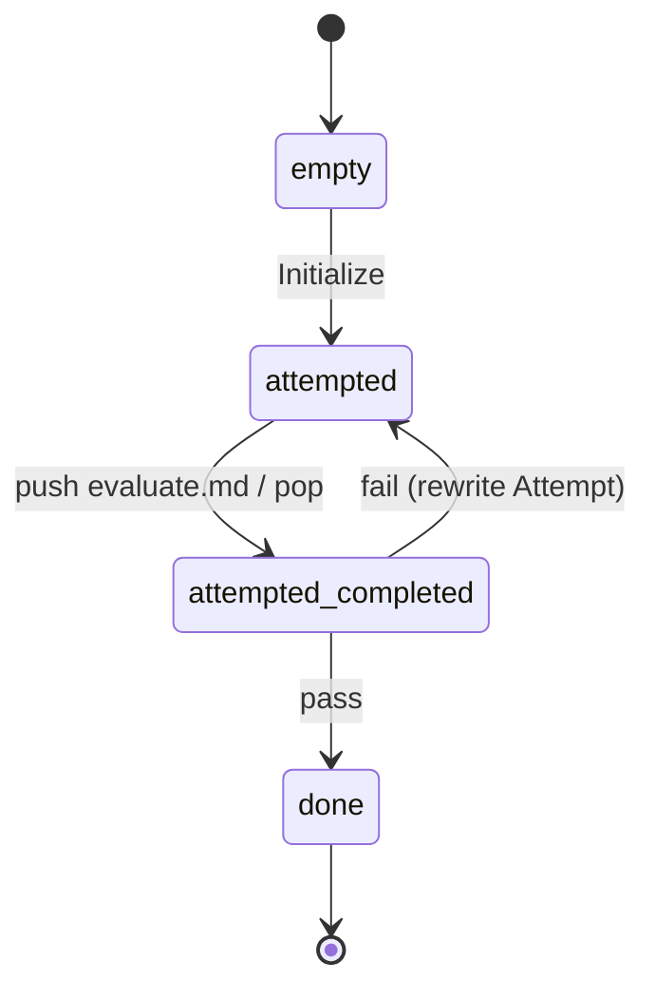

# b — Evaluator–Optimizer

*Anthropic, "Building Effective Agents", 2024. See
`docs/agent-workflows/patterns.md` §Group 1.*

Two distinct roles: a generator produces attempts, a separate evaluator
judges each attempt against an explicit `## Criterion` and returns a
pass/fail verdict plus structured feedback. No memory carries across
iterations beyond the current `## Attempt` and `## Criterion`.

## State machine



Four strategy instructions: `Initialize`, `Request evaluation`,
`Handle verdict`, `Finish`.

## Dynamic: `evaluate.md`

| | |
| --- | --- |
| Consumes | `## Attempt`, `## Criterion` |
| Produces | `## Verdict` (literal `pass` or `fail`), `## Feedback` |
| Internal states | `empty` → `done` (single instruction: `Judge`) |

This `evaluate.md` is the **canonical** copy. `c-reflexion/dynamics/
evaluate.md` is kept byte-equal via `src/test/phase-1-dynamics-identity.test.ts`.

## Demo `PROGRAM.md`

Rewrite a technical paragraph about prompt caching in plain,
non-expert English. The acceptance criterion has three bullets: ≤ 5
sentences, no listed jargon terms, preserves three factual claims.

## Run it

```bash
./new-instance.sh my-b interpreters/1-iterative-refinement/b-evaluator-optimizer
instances/my-b/run.sh
```

## Known behaviour

- The fail→retry loop only fires when the first attempt actually fails.
  Capable models often pass a "rewrite in plain English" criterion on
  the first try (the bundled demo typically halts in around 4 cycles).
  Pick harsher criteria — or a harder task — if you want to visibly
  exercise the loop.
- **Malformed verdict path:** if the evaluator returns anything other
  than literal `pass` or `fail`, the strategy treats the verdict as
  `fail` (conservative) and appends a non-blocking `## Pending
  Questions` item. It deliberately does *not* transition to
  `waiting_for_user` — that would stall the loop because this strategy
  has no `user_responded` handler.
- No iteration cap.
