# c — Reflexion

*Shinn et al., NeurIPS 2023 — "Reflexion: Language Agents with Verbal
Reinforcement Learning". See `docs/agent-workflows/patterns.md` §Group 1.*

Evaluator–Optimizer (variant b) **plus** an explicit reflection step after
every failed attempt. The reflect dynamic distils each failure into a
short verbal rule; rules accumulate in `## Lessons` and are read back
into every subsequent attempt. Each retry thus starts from the
accumulated memory of prior failures — "verbal RL".

## State machine

```mermaid
stateDiagram-v2
    [*] --> empty
    empty --> attempting: Initialize
    attempting --> attempted: Attempt
    attempted --> attempted_completed: push evaluate.md / pop
    attempted_completed --> done: pass
    attempted_completed --> failed_attempt: fail
    failed_attempt --> failed_attempt_completed: push reflect.md / pop
    failed_attempt_completed --> attempting: append Lesson; reset
    done --> [*]
```



Seven strategy instructions: `Initialize`, `Attempt`, `Request
evaluation`, `Route on verdict`, `Reflect`, `Accumulate lesson`,
`Finish`.

## Dynamics

| File | Consumes | Produces | Notes |
| --- | --- | --- | --- |
| `dynamics/evaluate.md` | `## Attempt`, `## Criterion` | `## Verdict`, `## Feedback` | **Byte-equal copy** of `b-evaluator-optimizer/dynamics/evaluate.md` — do not hand-edit |
| `dynamics/reflect.md` | `## Attempt`, `## Verdict` (+ `## Feedback` if present) | `## Lesson` | Single instruction `Distil lesson`; output is a directive ("always X", "avoid Y") |

## Demo `PROGRAM.md`

Write `is_palindrome(s: str) -> bool` in Python, case-insensitive and
ignoring non-alphanumeric characters, graded by a hidden test harness
(`workspace/tests/test_palindrome.py`). The harness is shipped as a
fenced Python block inside `test_palindrome.md` at the root of this
interpreter; the `Initialize` instruction extracts it and writes it to
`workspace/` on first cycle.

## Run it

```bash
./new-instance.sh my-c interpreters/1-iterative-refinement/c-reflexion
instances/my-c/run.sh
```

## Known behaviour

- **R11 vs. reality.** `requirements.md` R11 asks for ≥ 2 lessons
  accumulated before the live demo halts at `done`. The scripted
  integration test in `src/test/phase-1-reflexion.test.ts` enforces
  this. The **live demo with Claude Haiku 4.5 typically accumulates
  only 1 lesson** because the palindrome task is too canonical — the
  first naive attempt fails once (strips spaces only), the second
  applies the lesson and passes. See
  `docs/agent-workflows/phase-1-notes.md` §c reflexion for three
  proposed mitigations (harder hidden tests, different demo, relaxed
  R11 wording). The Reflexion *pattern* runs correctly; only the
  quantitative gate can fall short.
- `## Lessons` and `## Criterion` are preserved across iterations;
  `## Attempt`, `## Verdict`, `## Feedback`, and `## Lesson` are
  cleared by the `Accumulate lesson` instruction.
- No iteration cap (R10).
