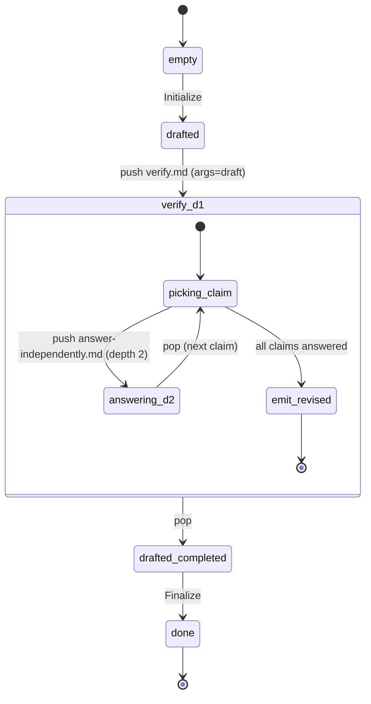

# d — Chain-of-Verification (CoVe)

*Dhuliawala et al., Meta, 2023 — "Chain-of-Verification Reduces
Hallucination in Large Language Models" (arXiv:2309.11495). See
`docs/agent-workflows/patterns.md` §Group 1.*

Decomposed self-critique. The drafter produces a candidate answer.
`verify.md` extracts the answer's atomic claims into N independent
verification questions and pushes `answer-independently.md` once per
question. Each child sees only its question (and PROGRAM.md for
shared premise context) — never the draft or the prior reasoning.
After all answers are gathered, `verify.md` emits `## Revised`.

This interpreter is **one-shot**: no acceptance loop. The pattern's
value is structural separation of drafting from claim-checking, not
iterative refinement.

## State machine



Four strategy instructions: `Initialize`, `Request verification`,
`Finalize`, `Finish`. No loop.

## Dynamics

| File | Receives | Produces | Notes |
| --- | --- | --- | --- |
| `dynamics/verify.md` | `{{draft}}` | `## Revised` (in MEMORY, returned to caller) | Runs at depth 1; iterates over claims, pushing answer-independently per claim. |
| `dynamics/answer-independently.md` | `{{question}}` | `## Answer` | Single-instruction. Runs at depth 2. Has no access to draft (structurally — its instructions reference no caller MEMORY section). |

## Demo `PROGRAM.md`

A twenty-person knights-and-knaves puzzle (P1 through P20), built
bottom-up with a unique solution: `V V V K K K K K K K V V V V V V
V K K K` (10 knaves, 10 knights). The puzzle composes a three-person
anchor (P1–P3, forced by a "different types" + cross-assertion
triple) with a 17-person chain of single-person assertions that
alternates type in deterministic blocks. N = 20 claims for `verify.md`
to decompose, giving the depth-2 verification fan-out a realistic
workout.

An earlier four-person variant of the puzzle (Alice/Bob/Carol/Dan)
was too easy for Haiku — the first draft was already correct and the
live run's revise step had nothing to fix. The twenty-person version
increases the chance that at least one claim in the first draft is
wrong, so CoVe can demonstrate *value* (correction), not just
*mechanics* (depth-2 stack reach).

## Run it

```bash
./new-instance.sh my-d interpreters/1-iterative-refinement/d-cove
instances/my-d/run.sh
```

## Known behaviour

- **Stack depth 2.** This is the first interpreter that exercises
  depth-2 push/pop. Mid-verification, `.call-stack.json` contains
  two frames; you can confirm by inspecting the file during a run.
- **Informal isolation.** `answer-independently.md`'s instruction
  text references no caller MEMORY section by name, so a compliant
  LLM has no instructed reason to read `## Draft`. A misbehaving
  model could still `cat MEMORY.md`; we accept this trade-off
  rather than build shell-level memory isolation.
- **One-shot.** If the revised answer is still wrong, the run
  halts with that output. A future hybrid (CoVe + Evaluator) would
  add an acceptance loop.
- No iteration cap.
