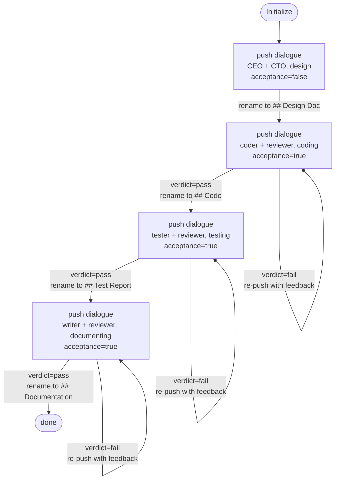

# b-chatdev

*ChatDev (Qian et al., 2023). See
`docs/agent-workflows/patterns.md` §Group 5.*

This interpreter implements ChatDev's **phase-dialogue** SOP:
four fixed phases — design, coding, testing, documenting — each
phase a dialogue between a role pair (CEO↔CTO for design,
specialist↔reviewer for the rest). The dialogue is the contract
between phases, not a document hand-off.

## State machine



Five strategy instructions: `Initialize`, `Design done — enter
coding`, `Coding done — enter testing`, `Testing done — enter
documenting`, `Finish`.

## Dynamics

| File                 | Consumes                                                                 | Produces           | Stack depth                |
| -------------------- | ------------------------------------------------------------------------ | ------------------ | -------------------------- |
| `dynamics/dialogue.md` | `{{participants}}`, `{{topic}}`, `{{input}}` (opt.), `{{acceptance}}` (opt.) | `dialogue_output`  | 1 (2 when acceptance=true) |
| `dynamics/evaluate.md` | `{{attempt}}`, `{{criterion}}`                                           | `verdict`, `feedback` | leaf (byte-equal to Phase 1b) |

Role descriptions under `./roles/` — `ceo.md`, `cto.md`,
`coder.md`, `reviewer.md`, `tester.md`, `writer.md` — are read
by `dialogue.md` via `bash cat`.

## Demo `PROGRAM.md`

Build `wc-plus` — same task as `../a-metagpt/PROGRAM.md`
(byte-equal, required by R22). Running both interpreters on the
same PROGRAM.md is the comparison the phase exists for.

## Run it

```bash
./new-instance.sh my-chatdev interpreters/5-fixed-sop-teams/b-chatdev
instances/my-chatdev/run.sh
```

## Known behaviour

- Dialogue turn limit: 10 (ChatDev paper §3.2). Convergence is
  usually reached earlier; the cap prevents runaway loops.
- **Two-agent isolation.** On each turn the LLM plays exactly one
  participant and reads only that participant's persona file
  (`roles/<speaker>.md`); the transcript on disk is shared but
  interpreted from the role's perspective only. Mirrors ChatDev's
  per-agent short-term memory without needing shell-level context
  separation.
- Consensus marker: `<SOLUTION>` (paper §3.2). Reviewer-paired
  phases (coding, testing, documenting) push `evaluate.md` and
  only return after a verdict; design phase does not.
- **Outer retry on `fail` verdict.** When `evaluate.md` returns
  `fail`, the strategy re-pushes `dialogue.md` for the same phase
  with the reviewer's feedback fed in via `input`. **No iteration
  cap (R10)** — convergence is the LLM's judgement, consistent
  with the other iterative interpreters in this repo. The
  divergence from ChatDev's `ComposedPhase.cycle_num` is
  intentional: the original cap exists in their codebase to bound
  GPT-4 spend; here we trust the loop to terminate.
- `## Dialogue Output` is renamed to the phase-specific section
  (`## Design Doc`, `## Code`, `## Test Report`,
  `## Documentation`) by the strategy after each dialogue
  returns.
