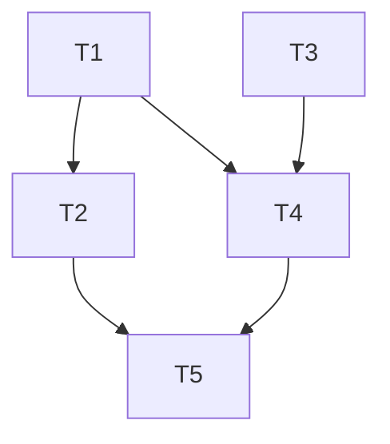

# SDLC POC Interpreter — Artefact Spec (locked)

Working spec for a TuringLLM interpreter that develops a POC end-to-end from
documentation of a system to mock. Phases: requirements → design + ADRs →
backlog (epics/features/stories) → tasks → dependency graph + waves.

SpecPath (`D:\source\SpecPath`) was used as the reference; this spec extends
it where the scope exceeds SpecPath (ADRs, story tree, dependency graph,
waves, red+green commits).

## Workspace layout

Every durable artefact lives in the instance's `workspace/` (which has its
own git repo and is what gets handed to a downstream implementer).
Frame-scoped intermediate files live in `frames/<frame>/scoped/` and are not
durable.

```
workspace/
├── 00-system-summary.md       # normalised digest of input docs
├── 01-requirements.md         # R# + EARS
├── 02-design.md               # P#, architecture, test strategy, ADR index
├── 02-adr/
│   ├── ADR-001-<slug>.md
│   ├── ADR-002-<slug>.md
│   └── ...
├── 03-backlog.md              # E# / F# / S# tree, stories carry Given/When/Then AC
├── 04-tasks.md                # T# flat, two-commit TDD (red then green)
└── 05-plan.md                 # T# dependency graph + W# waves
```

## ID conventions

| ID    | Object                | Format       | Stable across refinement? |
| ----- | --------------------- | ------------ | ------------------------- |
| R#    | Requirement           | `R1`, `R2`   | Yes — append, never renumber |
| P#    | Correctness property  | `P1`, `P2`   | Yes |
| ADR-# | Architecture decision | `ADR-001`    | Yes, zero-padded |
| E#    | Epic                  | `E1`         | Yes |
| F#    | Feature               | `E1.F1`      | Yes — parent-qualified |
| S#    | User Story            | `E1.F1.S1`   | Yes — parent-qualified |
| T#    | Task                  | `T1`, `T2`   | Yes — flat, append-only |
| W#    | Wave                  | `W1`, `W2`   | Recomputed each plan rebuild |

Rationale for parent-qualified epic/feature/story IDs: tree is readable
inline; refinement never collides. Tasks stay flat because waves and
dependency edges cross-cut them.

## Traceability invariants (enforced at every gate)

1. Every `R#` → ≥ 1 story in backlog → ≥ 1 task in tasks → exactly 1 wave in plan.
2. Every `ADR-###` → referenced by ≥ 1 design section or feature.
3. Every `P#` → ≥ 1 row in Test matrix → ≥ 1 task step.
4. Every task's `Depends on` cites only existing `T#`s; graph is acyclic.
5. IDs are never renumbered on refine; only appended.
6. Every non-trivial design choice is either an ADR or explicitly marked "no ADR needed — local choice".
7. Every story has Given/When/Then acceptance criteria of its own (not just inherited R# coverage).
8. Every task in `04-tasks.md` produces exactly one red commit followed by exactly one green commit.

## Artefact templates

### `00-system-summary.md`

Normalises the input docs. Durable upstream of Requirements — once approved,
Requirements never re-reads raw docs.

```markdown
# System Summary: <system-to-mock>

## Source documents
- <path or title> — <one-line description>
- ...

## Purpose of the real system

## External interfaces
- <name>: <shape> — <who calls it / who it calls>

## Internal subsystems
- <name>: <one-paragraph role>

## Data model (as observed)

## Behaviours to preserve in the mock
- <numbered list — feeds R# extraction>

## Behaviours intentionally NOT mocked
- <numbered list — feeds Out of scope in requirements>

## Ambiguities / contradictions in the source docs
- <numbered list — feeds Open questions>
```

### `01-requirements.md`

```markdown
# Requirements: <POC-name>

## Context
<2–5 paragraphs framing what is being mocked and why a POC is being built.>

## User stories (high level)
<bulleted, narrative — not the granular S# stories of the backlog. Just enough to motivate R#.>

## Acceptance criteria (EARS)
- **R1** — When <trigger>, the system shall <observable behaviour>.
- **R2** — While <state>, the system shall <invariant>.
- **R3** — If <unexpected condition>, then the system shall <response>.
- ...

## Out of scope
- <numbered list>

## Open questions
- <numbered list, each marked [blocker] or [non-blocker]>
```

EARS templates: *When*, *While*, *Where*, *If/Then*, *Ubiquitous*
("The system shall always …"). Acceptance criteria must be testable and
implementation-agnostic.

### `02-design.md`

```markdown
# Design: <POC-name>

## Overview

## Requirement coverage
| R# | Addressed by |
| -- | -- |
| R1 | <architecture component / ADR-### / test surface> |
| R2 | ... |

## Architecture
<diagrams (mermaid), components, sequence flows>

## Data model

## Interfaces / API

## Error handling

## Correctness properties
- **P1** — <invariant>. Traces to: R#, R#.
- **P2** — ...

## Decisions (ADR index)
| ADR | Title | Status | Drives |
| --- | --- | --- | --- |
| ADR-001 | <title> | accepted | R1, R3, P2 |
| ADR-002 | ... | proposed | ... |

## Test strategy
### Unit tests
### Integration tests
### Property-based tests

## Test matrix
| R# | P# | Category | Verification surface |
| -- | -- | -------- | -------------------- |
| R1 | -  | Unit     | `tests/unit/foo.spec.ts::handles_basic` |
| R2 | P1 | Property | `tests/prop/bar.prop.ts` |
| ... |

## Open questions
```

### `02-adr/ADR-NNN-<slug>.md`

One file per decision. Classic Nygard shape with explicit back-references.

```markdown
# ADR-001: <decision title>

- **Status:** proposed | accepted | superseded by ADR-### | deprecated
- **Date:** YYYY-MM-DD
- **Drives requirements:** R1, R3
- **Relates to properties:** P2

## Context
<the forces in tension — why a decision is needed>

## Decision
<the choice taken, in one or two sentences first, then expanded>

## Consequences
- **Positive:** ...
- **Negative:** ...
- **Neutral / follow-ups:** ...

## Alternatives considered
- **Alt A:** <one-paragraph description>. Rejected because <reason>.
- **Alt B:** ...
```

Rule: every non-trivial choice in `02-design.md` either has an ADR or is
explicitly marked "no ADR needed — local choice".

### `03-backlog.md`

The epic → feature → story tree. Stories are the unit a developer can
plausibly understand end-to-end; tasks (next file) are the unit they can
execute in one sitting.

```markdown
# Backlog: <POC-name>

## Tree

### E1: <Epic name>
**Goal:** <one paragraph>
**Satisfies:** R1, R2, R5

#### E1.F1: <Feature name>
**Satisfies:** R1, R2
**ADRs:** ADR-001

##### E1.F1.S1: <Story title>
> As a <role>, I want <capability>, so that <benefit>.
- **Satisfies:** R1
- **Acceptance:**
  - Given <state>, when <action>, then <observable outcome>.
  - ...
- **Realised by tasks:** T1, T2, T7

##### E1.F1.S2: ...

#### E1.F2: ...

### E2: ...

## Coverage check
- Every R# below appears under at least one story.
- R1 → E1.F1.S1
- R2 → E1.F1.S1, E1.F2.S3
- ...
```

### `04-tasks.md`

Flat list, TDD-shaped, two commits per task (red + green).

```markdown
# Tasks: <POC-name>

## Index
| T# | Title | Story | Satisfies | Files |
| -- | ----- | ----- | --------- | ----- |
| T1 | Create user repository skeleton | E1.F1.S1 | R1 | `src/repo/user.ts` |
| T2 | ...

## T1: Create user repository skeleton
- **Story:** E1.F1.S1
- **Satisfies:** R1
- **Property anchored:** —
- **Files:**
  - Create: `src/repo/user.ts`, `tests/unit/repo/user.spec.ts`
  - Modify: `src/index.ts`
  - Test: `tests/unit/repo/user.spec.ts`

### 1.1 Write the failing test
- [ ] Step 1: Write the failing test
  - Test category: Unit
  - Correctness property: —
  - Expected failure: `UserRepo is not defined`
- [ ] Step 2: Run test to verify it fails
  - Command: `npm test -- tests/unit/repo/user.spec.ts`
  - Expected output: `1 failing`

### 1.2 Commit the failing test (red)
- [ ] Step 3: Commit
  - Message: `test(T1): add failing test for UserRepo skeleton`
  - The commit must include the new/modified test file(s) only, not implementation.

### 1.3 Implement
- [ ] Step 4: Write minimal implementation
- [ ] Step 5: Run test to verify it passes
  - Command: `npm test -- tests/unit/repo/user.spec.ts`
  - Expected output: `1 passing`

### 1.4 Commit the passing implementation (green)
- [ ] Step 6: Commit
  - Message: `feat(T1): implement UserRepo skeleton`
```

Rules for tasks:
- Every story has ≥ 1 task.
- Every Test-matrix row in `02-design.md` is expanded into ≥ 1 task.
- No placeholders ("TODO", "similar to previous task", vague guidance).
- Every task produces **two commits** in sequence: a red commit (test
  files only, failing) and a green commit (implementation files, passing).
- Red-commit message convention: `test(T#): ...`. Green-commit message
  convention: `feat(T#): ...` (or `fix(T#)`, `refactor(T#)` where
  applicable).
- Red commit must not contain implementation code; green commit must not
  contain new failing tests. This split is what makes the dependency-graph
  + waves replayable: each task is two atomic moves on the project repo.

### `05-plan.md`

Pure-topological waves. Resource-constrained scheduling is out of scope.

````markdown
# Plan: <POC-name>

## Dependency table
| T# | Depends on | Reason |
| -- | ---------- | ------ |
| T1 | —          | (root) |
| T2 | T1         | T2 imports the repo created in T1 |
| T3 | —          | independent module |
| T4 | T1, T3     | wires repo and module into the API |
| ... |

## Dependency graph



## Waves
A wave is a maximal set of tasks with no intra-wave dependencies, all of
whose dependencies are in earlier waves.

### W1 — foundation (parallelisable)
- T1, T3

### W2
- T2, T4

### W3
- T5

## Critical path
T1 → T4 → T5  (3 waves, longest chain)

## Parallelism summary
- Total tasks: 5
- Waves: 3
- Max width: 2 (W1, W2)
- Sequential floor: 3 (= depth of critical path)

## Assumptions / cross-wave caveats
- <e.g. "T3 touches the same config file as T1 — if both are run in
  parallel, the second to merge must rebase">
````

Rules for plan:
- Every `T#` appears in exactly one wave.
- Waves numbered W1..Wn.
- Graph must be a DAG (no cycles).
- Critical path = longest path in the DAG.

## Resolved open questions

| # | Question | Resolution |
| - | -------- | ---------- |
| 1 | Keep `00-system-summary.md` separate or fold into requirements? | **Separate.** Input docs are usually messier than a feature request. |
| 2 | Stories carry their own Given/When/Then AC, or just inherit R#? | **Carry their own.** Stories are what an implementer reads end-to-end. |
| 3 | ADRs as separate files or single `02-adr.md`? | **Separate files.** Individually linkable and refinable. |
| 4 | Waves: pure-topological or resource-constrained? | **Pure-topological.** |
| 5 | Property-based tests (P#) — keep / drop / optional? | **Keep mandatory.** |
| 6 | Artefacts in `workspace/` vs. `frames/<frame>/scoped/`? | **Durable in `workspace/`; intermediate drafts in frame-scoped dirs.** |

## Out of scope for the artefact spec (deferred)

- Interpreter frame/operator topology (which phase pushes what; how refine
  loops work at each gate).
- Gate verbs and orchestrator state machine.
- How input docs get into `00-system-summary.md` (Telegram drop? PROGRAM.md
  path list? `workspace/inputs/` convention?).
- Whether `04-tasks.md` is produced by one pass or by a per-story
  decomposition push.
